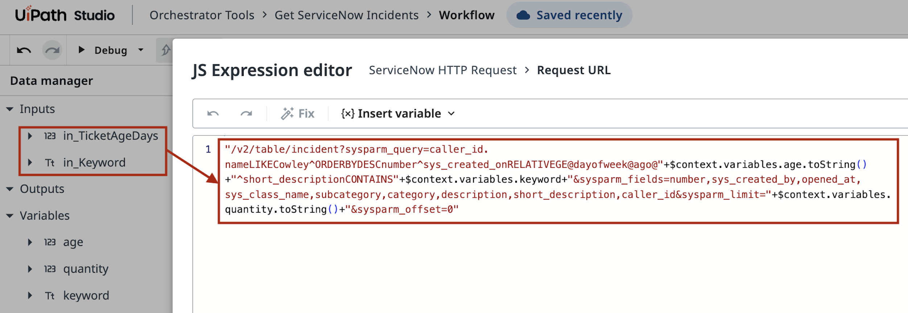
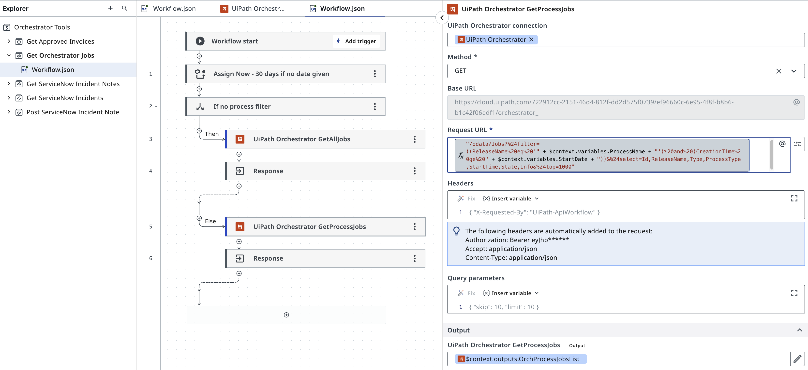
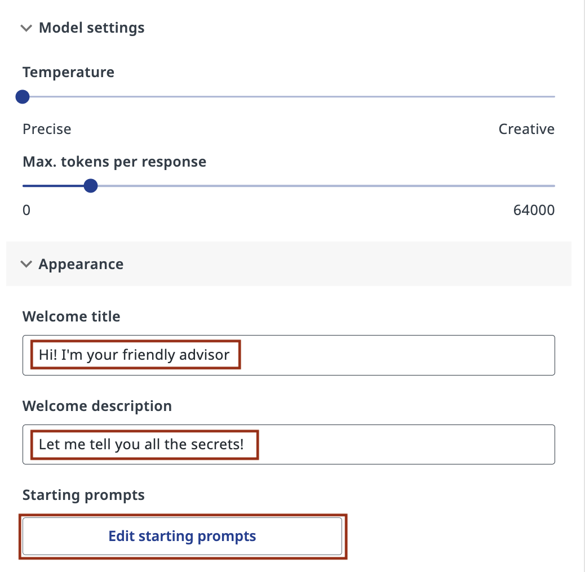
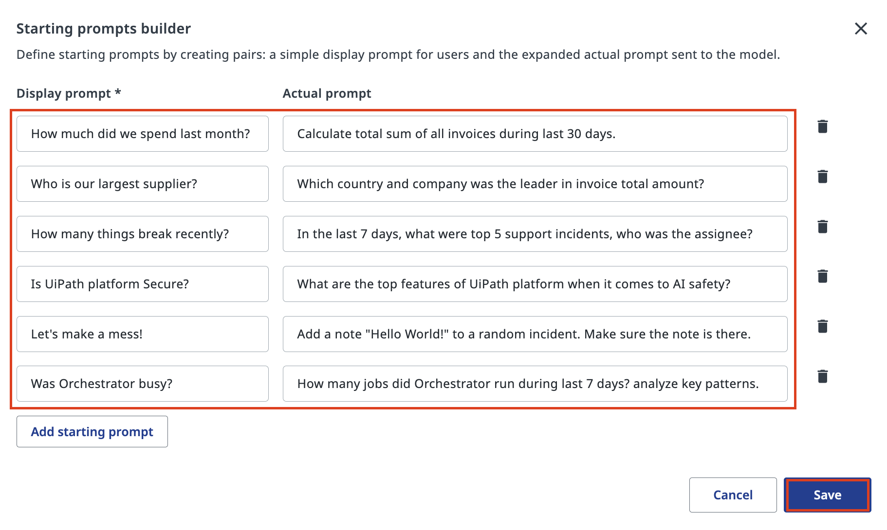

# Understanding Available Tools

!!! tip "Here is our plan for this lesson:"

    1. Find the **Orchestrator Tools** template in **Studio Web**
    2. Open workflows and understand their type and structure and how they process data internally
    3. Examine tool arguments (inputs and outputs)

## Goal

In this lesson you'll explore the tools available to your agent by examining their source code. The tools that we have added are pre-built automations (**RPA and API Workflows**) that your agent can invoke - understanding what they do, what data they need (inputs) and what data they return (outputs) is essential to configuring and using your agent correctly.

## What Are Tools?

Tools are reusable automations built in Studio Web and published to **Orchestrator** in **Orchestrator Tools** folder. When your agent needs to do something - query **Data Fabric** to retrieve invoice data, list ServiceNow incidents or add a note to an Incident - it finds a best matching tool based on it's description and runs it. Tools you will see here are simple, but these could be any existing components available in Orchestrator which you want to expose to a chatbot, including UI automations or Integration Service activities.

In any case, each tool has a **Workflow** (the automation logic inside), **Inputs** - data the tool needs to run execute workflow, **Outputs** - data the tool returns to the agent. 

Data for Input Arguments is generated based on **Argument Descriptions** and **Prompts** every time - this is the reason why we alwasy write the descriptions. The tool call creates an Orchestrator Job in the backend and waits for results when Job is completed. Agent then reviews the results and continues moving to it's goal, or achieving it and finishing it's own execution.

By reviewing your tools before configuring your agent, you'll understand what your octopus agent can do.

## Steps

### 1. Find the Orchestrator Tools template

In **Studio Web**, click the **Templates** tab to browse available starting templates.

Search for "orchestrator tool" to find the **Orchestrator Tools Template** - a pre-built solution containing common automation tools.

[[[
Open the three-dot menu on the template card and select **New solution from template**. You don't need to publish it as tools have already been deployed in Orchestrator. We will only review the source code.
|30|
{ .screenshot }
]]]

### 2. Examine API workflows

Once the template solution loads, expand the **Orchestrator Tools** folder in the Explorer panel on the left.

You'll see a list of available tools. Select API workflow called **Get ServiceNow Incident Notes** to start with.

[[[
{ .screenshot }
|70|
Select **Workflow.json** under the tool folder to see the automation steps inside.
]]]

ServiceNow tools build their requests dynamically. **ServiceNow HTTP Request** has a JS expression which shows exactly how the API query URL is constructed from the tool's input arguments. API response is parsed and sent as output, which goes back to agent. 

{ .screenshot width="900" }

API workflow like **Get Orchestrator Jobs** work the same way, but talks to Orchestrator instead of ServicnNow. It filters jobs by process name and time range. Notice the special date format and how we instruct agent in Argument's description: 
```
Filter jobs after this date. Format: "2026-04-07T00%3A00%3A00.00Z". Default 30 days from today.
```

{ .screenshot width="900" }


### 3. Review RPA tool

Open **Get Approved Invoices** - RPA workflow that reads data from Data Fabric: 

{ .screenshot width="800"}

[[[
Open the **Data Manager** panel to see the tool's configuration.

These arguments tell you exactly what to expect when your agent calls this tool. The agent will pass data to inputs and receive data from outputs. Pretty much the same approach.
|70|
{ .screenshot }
]]]

### 5. One last thing

Before running actual tests, it's a good practice to add a welcome message and recommend prompts that the agent is supposed to answer. Open your agent's configuration and fill in the **Appearance** section:

[[[
Set a **Welcome title** and **Welcome description**, then click **Edit starting prompts** to define the suggested questions that appear in the chat interface. 

Starting prompts appear as clickable chips in the chat interface. They're a quick way to kick off common test conversations — and to give end users a helpful starting point.

Open your agent's configuration. In the **Appearance** section, click **Edit starting prompts**.
|50|
{ .screenshot }
]]]

Each row has two fields: a short **Display prompt** the user sees, and the full **Actual prompt** sent to the model. Keep display prompts short and friendly; put the real detail in the actual prompt.

Click **Save** when done.

{ .screenshot width="900" }

Your agent is now ready to use these tools confidently — let's give it a try!
