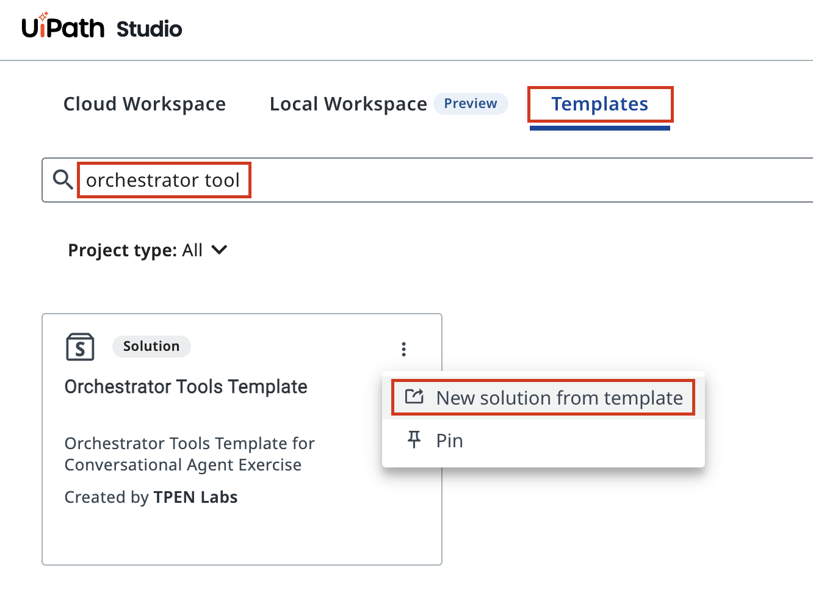
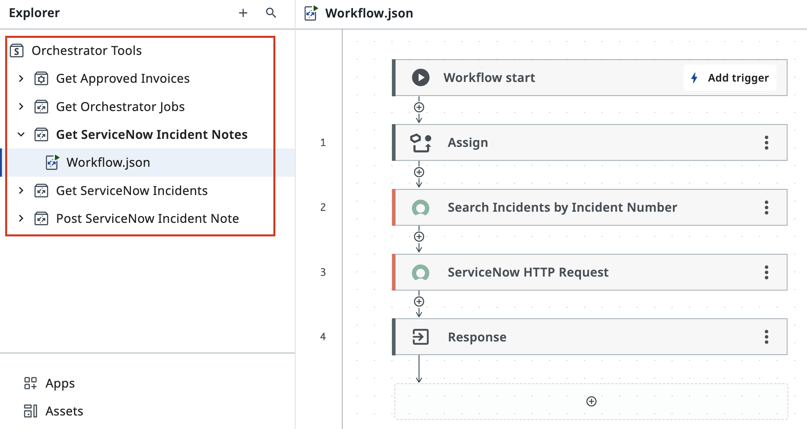
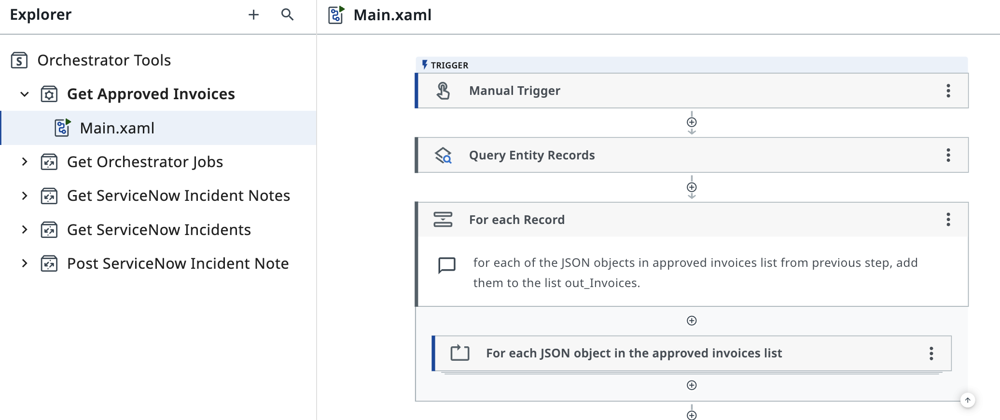
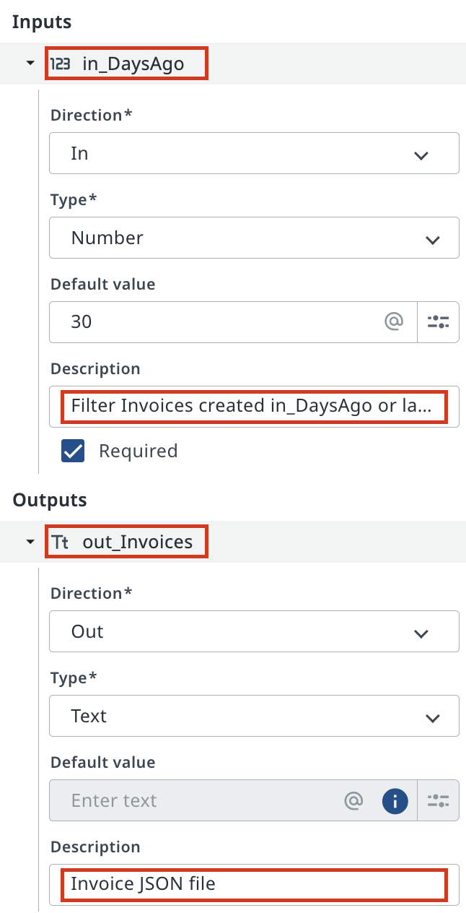

# Understanding Available Tools

!!! tip "Here is our plan for this lesson:"

    1. Find the Orchestrator Tools template in **Studio Web**
    2. Open a tool workflow and understand its structure
    3. Review how tools process data internally
    4. Examine tool arguments (inputs and outputs)

## Goal

You'll explore the tools available to your agent by examining their internal workflows. Tools are pre-built automations that your agent can invoke — understanding what they do and what data they need (inputs) and return (outputs) is essential to configuring your agent correctly.

## What Are Tools?

Tools are reusable automations stored in **Orchestrator**. When your agent needs to do something — retrieve invoice data, query a database, update a ServiceNow incident — it calls a tool. The tool runs the automation and returns results.

Each tool has:
- **A workflow** — the automation logic inside
- **Inputs** — data the tool needs to run (e.g., "Invoice ID")
- **Outputs** — data the tool returns to the agent (e.g., "Invoice details JSON")

By reviewing your tools before configuring your agent, you'll know exactly what your agent can do.

## Steps

### 1. Find the Orchestrator Tools template

In **Studio Web**, click the **Templates** tab to browse available starting templates.

Search for "orchestrator tool" to find the **Orchestrator Tools Template** — a pre-built solution containing common automation tools.

[[[
Open the three-dot menu on the template card and select **New solution from template**.
|30|
{ .screenshot }
]]]

### 2. Open and examine a tool workflow

Once the template solution loads, expand the **Orchestrator Tools** folder in the Explorer panel on the left.

You'll see a list of available tools. Each one is a folder containing the tool's workflow. Select any tool to explore it — for example, **Get ServiceNow Incident Notes**.

[[[
{ .screenshot }
|30|
Select **Workflow.json** under the tool folder to see the automation steps inside.
]]]

### 3. Review the tool's implementation

The workflow canvas shows the tool's internal logic. This gives you insight into what the tool actually does.

For example, the **Get ServiceNow Incident Notes** tool contains:
- **Assign** — set up variables
- **Search Incidents by Incident Number** — query ServiceNow
- **ServiceNow HTTP Request** — fetch the data
- **Response** — format and return the result

Each tool is built this way: initialize, query external systems, process results, return structured data.

{ .screenshot }

### 4. Check tool arguments (inputs and outputs)

Tool arguments define what data flows in and out. Open the **Data Manager** panel (usually on the right side) to see the tool's configuration.

**Inputs** are data the tool needs:

```css hl_lines="1"
in_DaysAgo
```
```text
A number specifying how many days back to filter invoices. Default value: 30.
```

**Outputs** are data the tool returns:

```css hl_lines="1"
out_Invoices
```
```text
Invoice JSON file containing all matching invoices.
```

These arguments tell you exactly what to expect when your agent calls this tool. The agent will pass data to inputs and receive data from outputs.

{ .screenshot }

### 5. Review all available tools

Spend a few minutes exploring the other tools in the Orchestrator Tools folder. Each one represents an action your agent can take. By the time you're done, you'll have a mental map of:
- What each tool does
- What data it needs (inputs)
- What data it returns (outputs)
- Which tools are relevant to your agent's domain

This knowledge ensures your agent will be configured to use the right tools for the right situations. An agent without this context might invoke a tool incorrectly or pick the wrong tool for a question.

Your agent is now ready to use these tools confidently. In the next lesson, you'll connect your agent to external systems via MCP servers.
