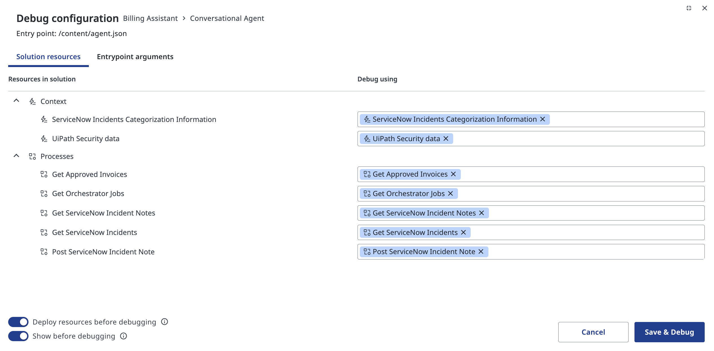
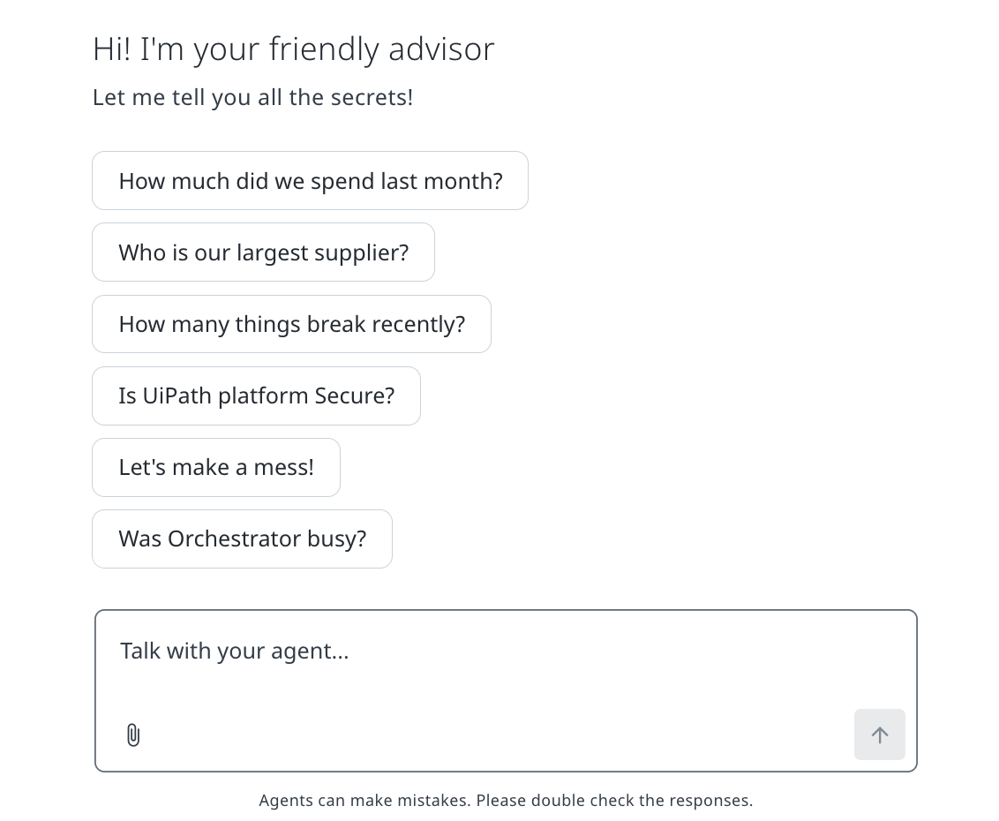
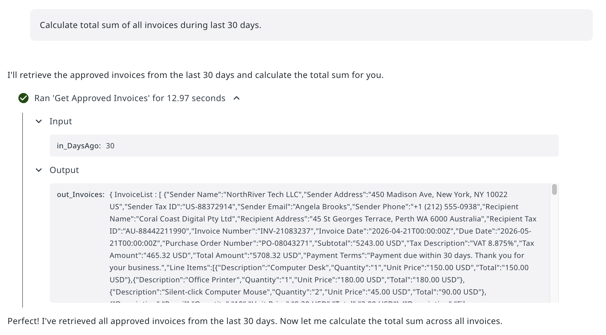
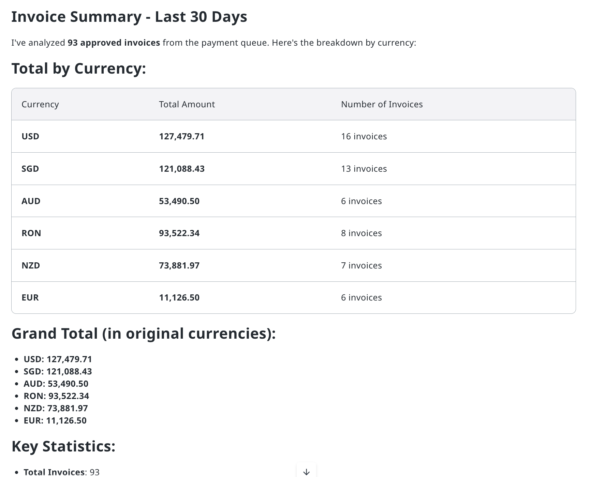
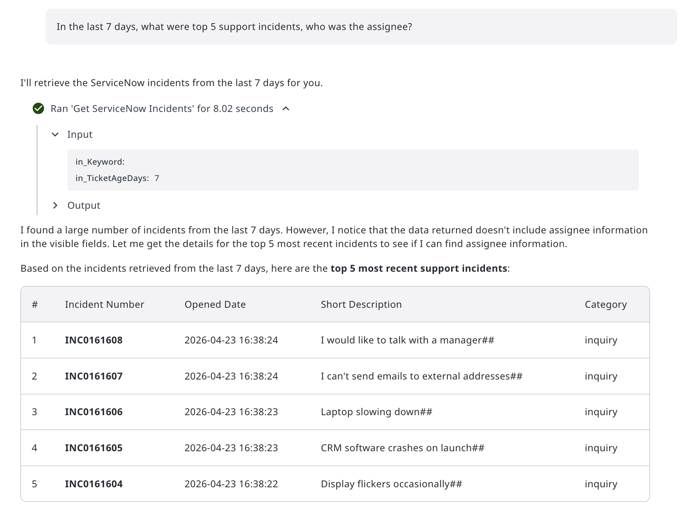
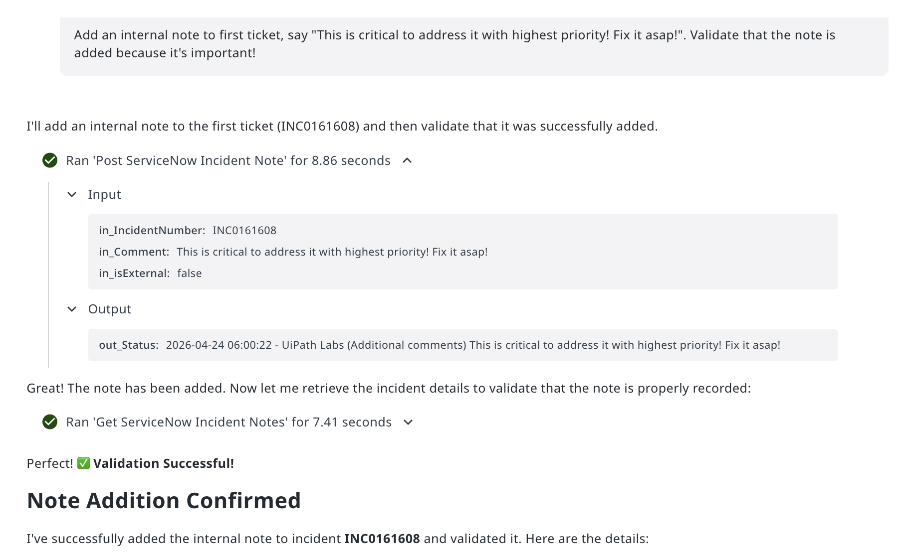
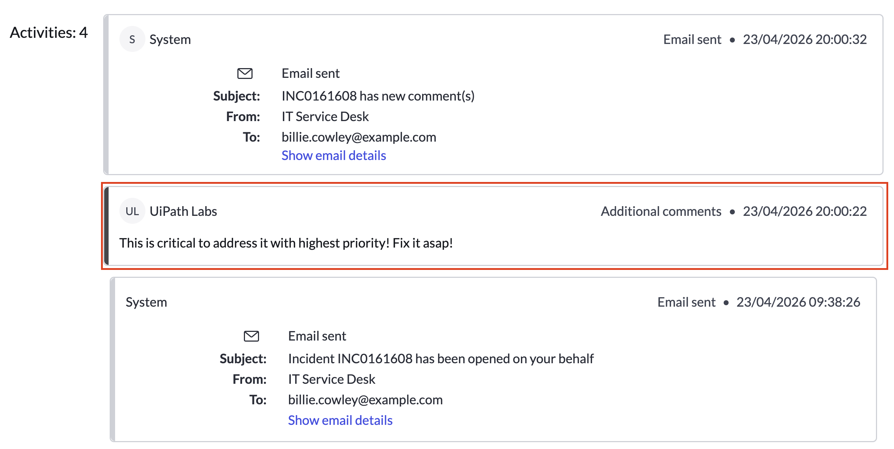
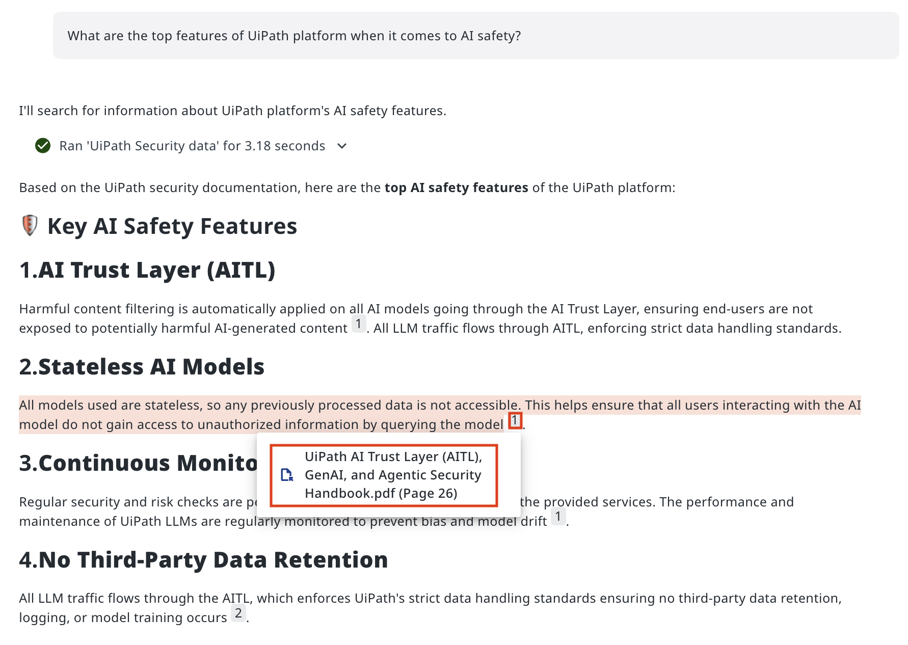
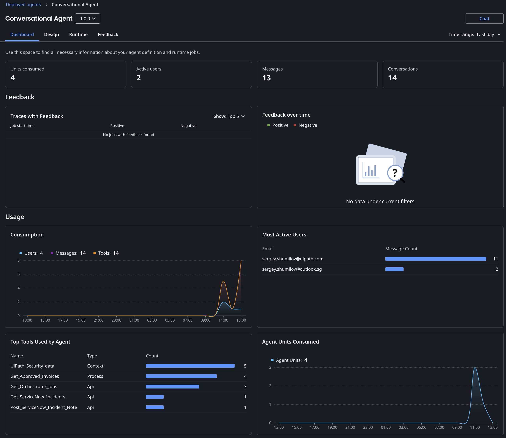

# Giving It a Try

!!! tip "Here is our plan for this lesson:"

    1. Run the agent in debug mode and try it from several different angles
    2. Test starting prompts to make common questions easy to kick off
    3. Evaluate each response - does the agent use the right tools, cite its sources, and handle write operations correctly?

## Goal

By the end of this lesson, you'll have run your agent through four types of conversations: a data query, an incident lookup, a post comment operation, and a knowledge question grounded in your context sources. You'll use the debug interface to watch each tool call happen in real time, and judge for yourself whether the responses are accurate and trustworthy.

## Testing by conversation

Automated testing catches regressions. Manual conversation testing catches something different: whether the agent actually *makes sense* and gives you what you want. If something is wrong - go back and review the prompt.

When you run a conversation test, look at four things:

- **Tool usage** - Did the agent call the right tool? Did it pass sensible arguments?
- **Response quality** - Is the answer accurate, well-formatted, and appropriately detailed?
- **Write operations** - When the agent changes data, does the change actually stick?
- **Grounding** - When the answer comes from your documentation, is it properly cited?

A few well-chosen conversations across these four categories gives you a solid read on agent quality.

## Steps

### 1. Start a chat session

Click **Debug** to open the debug configuration dialog. Review the resources listed under **Context** and **Processes** - these are what the agent will have access to during the session.

{ .screenshot width="900" }

Make sure all the tools and context sources you want to test are ticked, then click **Save & Debug**.

### 2. See the chat interface

The chat loads with your starting prompt chips ready to go.

[[[
Click one of the chips or type your own message. The agent always receives the full actual prompt - not just the short display text.
|30|
{ .screenshot }
]]]

### 3. Test a data query: invoice spending

Click **How much did we spend last month?** The actual prompt sent to the agent is:

```text
Calculate total sum of all invoices during last 30 days.
```

Watch the execution trace. The agent calls **Get Approved Invoices** with `in_DaysAgo: 30` and receives a full invoice list from Data Fabric in return:

{ .screenshot width="900" }

The agent then processes the data and returns a clean summary:

[[[
Check that the numbers and currency breakdown look reasonable for the volume of invoices you know is in the system.
|30|
{ .screenshot }
]]]

### 4. Test an incident lookup

Click **How many things break recently?** The actual prompt is:

```text
In the last 7 days, what were top 5 support incidents, who was the assignee?
```

The agent calls **Get ServiceNow Incidents** with `in_TicketAgeDays: 7` and returns a list of recent tickets, which agent analyzes and responds with top five:

{ .screenshot width="900" }

Notice that when assignee information isn't returned in the initial result, the agent flags it rather than inventing data. That's a good sign.

Now for the trickier one. Type:

```text
Add an internal note to first ticket, say "This is critical to address it with highest priority! Fix it asap!". Validate that the note is added because it's important!
```

The agent calls **Post ServiceNow Incident Note**, then immediately runs **Get ServiceNow Incident Notes** to verify the change:

{ .screenshot width="900" }

The agent doesn't just fire off the write and assume it worked - it validates. That's the right behaviour to look for.


[[[
To be very sure, you can ask your trainer to look up the incident directly in ServiceNow and check the activity timeline. The agent made a real change in a live system - the note appears exactly as written.
|30|
{ .screenshot }
]]]


### 5. Test context grounding

Finally, click **Is UiPath platform Secure?** The actual prompt asks specifically about AI safety features.

The agent searches the **UiPath Security data** context source and returns a structured answer. Click the citation marker (`1`) to verify the source:

{ .screenshot width="900" }

The citation links back to the correct page in the grounded knowledge base. Whenever you click, you will be redirected to the source document/file. Answers without citations - or citations pointing to the wrong document - are a signal that the context source needs revisiting.


### 6. Going live

Just like any other UiPath solution, agent needs to be published and deployed into a folder. 

To avoid too many copies, we can use this one published into Conversational Agent folder for everyone: [direct link](https://cloud.uipath.com/tpenlabs/AgenticPractice/autopilotforeveryone_/conversational-agents/?agentId=418563&mode=embedded). It will appear in Deployed Agents list and you can monitor statistics and usage data. Feedback sent by users will be also populated here:

{ .screenshot }

<details ontoggle="if(this.open) { this.querySelector('iframe').src = this.querySelector('iframe').getAttribute('data-src'); }">
  <summary>You can even embed conversational agents into your applications!</summary>
  <div class="iframe-container">
    <iframe 
        data-src="https://cloud.uipath.com/tpenlabs/AgenticPractice/autopilotforeveryone_/conversational-agents/?agentId=418563&mode=embedded" 
        src="about:blank"
        width="100%" 
        height="500" 
        frameborder="0"
        allowfullscreen>
    </iframe>
  </div>
</details>

Everything looks just nice and the exercise is complete!