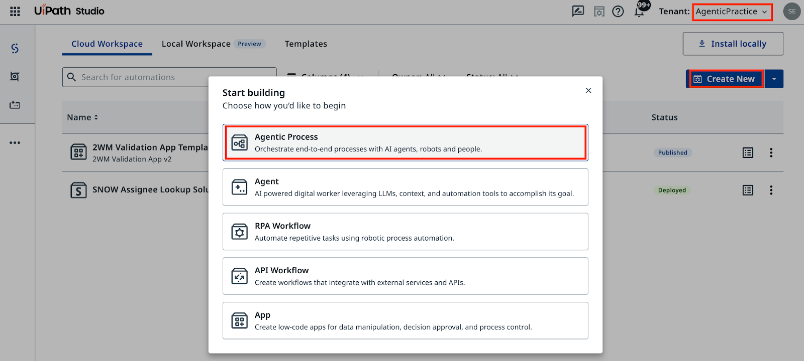
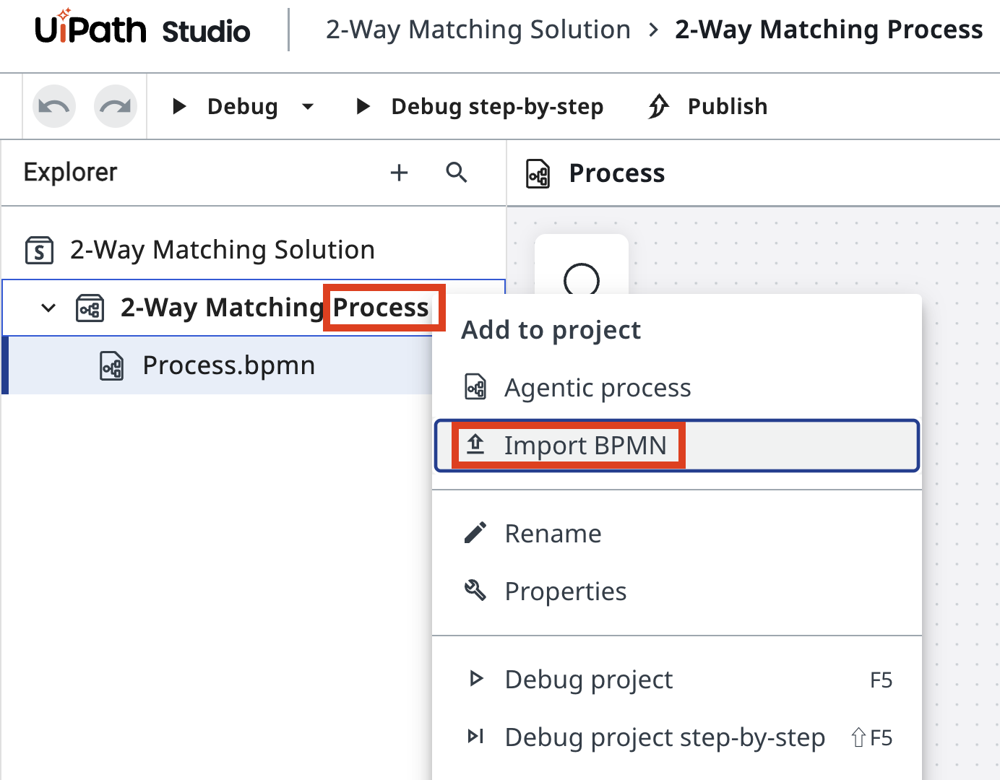
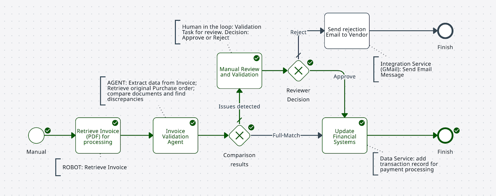
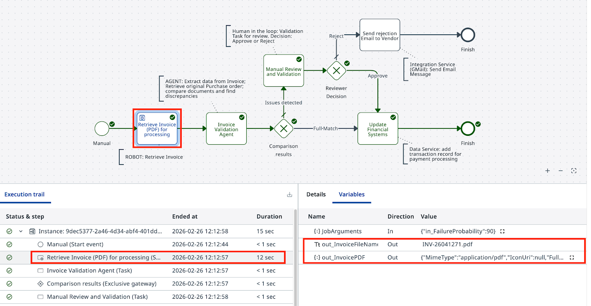

# Automating Tasks using Robots

!!! tip "Here is our plan for this lesson:"

    1. Create a **Maestro** agentic process in **Studio Web** and import your BPMN diagram

    2. Connect the RPA robotic task to the **RetrieveInvoiceDocument** process

    3. Run a debug session to verify the robot's output

## Goal

Create a Maestro Agentic Process, import your BPMN diagram, and connect the first task to the **RetrieveInvoiceDocument** RPA process. The robot simulates retrieving an invoice PDF and outputs the file name stored in a Storage Bucket. The agent in the next step will extract structured data from that PDF using IXP.

## About the Robot Process

In this simulated scenario, the company processes hundreds of invoices per day. Data is stored in ERP and Accounts Payable systems that don't always have APIs or direct database access. RPA automation using UI interaction is often the only way to extract that data, and this is where UiPath shines.

The **RetrieveInvoiceDocument** process simulates retrieval of an invoice and outputs the PDF file, and the location of this file in Orchestrator's Storage Bucket. The process has already been configured in Orchestrator in the **2-Way Matching IXP** folder - you will not need to write it.

## Steps

### Create the Agentic Process

1. In **Studio Web**, make sure you are building in the right Tenant (**AgenticPractice**), click **Create New** and select **Agentic Process**.

    { .screenshot }

2. Open **Project Explorer**, right-click on the Agentic Process, and select **Import BPMN**. Select the `.bpmn` file you exported in the previous step.

  { .screenshot }

2. Open **Project Explorer**, right-click on the Agentic Process, and select **Import BPMN**. Select the `.bpmn` file you exported in the previous step.

    { .screenshot }

3. Delete the auto-generated empty process placeholder.

4. Rename the solution to **2-Way Matching Solution** and the process to **2-Way Matching Process**.

    { .screenshot }

5. Click **Debug** to run the imported diagram. Unlike a static BPMN tool, Maestro can actually execute the model — observe how it follows connections and decision paths.

    { .screenshot }

### Configure the robot task

6. Select the robot task node in the BPMN canvas.

7. In the properties panel, set the action to **Start and wait for RPA workflow**.

    { .screenshot }

8. Search for and select **RetrieveInvoiceDocument** from the **2-Way Matching IXP** folder.

    { .screenshot }

9. Set a value for **in_FailureProbability**. This controls the probability (in percent) that the invoice won't match the PO. Set it to **90** so the validation path triggers frequently during testing. You can adjust it at any time.

    { .screenshot }

### Test the process

10. Click **Debug** to run the process.

    { .screenshot }

11. Check the execution details. If you see a file name in the output variables, the robot retrieved the invoice PDF successfully.

    { .screenshot }

At this step, don't worry about manually configuring input/output parameters — variables are automatically created for subsequent steps.

12. Close debug mode and save the process.

    { .screenshot }
